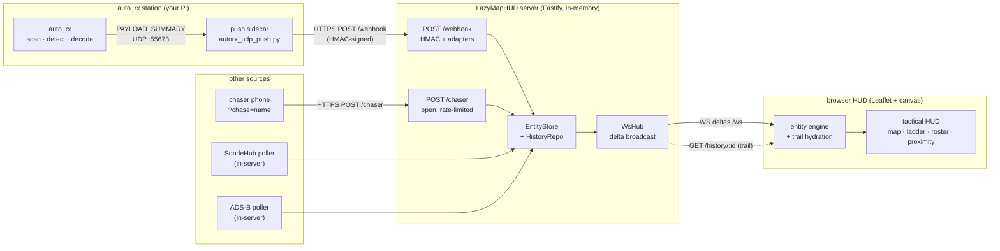

# System Architecture

How telemetry gets from a radio receiver to a browser HUD, and the pieces in
between. For the wire format see [webhook-contract.md](webhook-contract.md); for
hosting see [deployment.md](deployment.md).

## One idea to hold onto

**The server is passive. Sources push *in*; it never reaches *out* to a
receiver.** Every feed — an auto_rx station, a SondeHub poller, a chaser phone —
converges on a single write path (`store.upsert`) and fans back out to browsers
over one WebSocket. Add a new source by teaching it to POST the
[Entity contract](webhook-contract.md); nothing downstream changes.

## End-to-end flow

## The auto_rx station ↔ map path (primary feed)

1. **Detect** — `radiosonde_auto_rx` scans a band, auto-identifies any sonde in
   range (RS41/RS92/DFM/M10…), and decodes it. No serial known in advance.
2. **Emit** — on each decoded frame auto_rx broadcasts a JSON `PAYLOAD_SUMMARY`
   packet on **UDP :55673** (the ChaseMapper feed; needs no web server).
3. **Push** — a stdlib sidecar on the station maps the packet to the Entity
   contract, HMAC-signs it, and `POST`s to the map's public `/webhook`. The
   station reaches out; the map never reaches in — works behind NAT.
4. **Ingest** — `/webhook` verifies the signature, an adapter normalizes the
   body, `EntityStore.upsert` writes the live snapshot + a trail point.
5. **Broadcast** — the store hands the change to `WsHub`, which pushes a delta
   to every connected browser over `/ws`.
6. **Render** — the HUD moves the marker, extends the trail, updates the
   telemetry panel and altitude ladder; if a chaser is within 1 km it fires the
   proximity alert.

Three station transports exist (same destination, different tap point) — full
setup in **[autorx-feed.md](autorx-feed.md)**:

| Sidecar | Taps auto_rx via | Runs on | Direction |
|---|---|---|---|
| `autorx_udp_push.py` | PAYLOAD_SUMMARY UDP :55673 | station | push out ✅ recommended |
| `autorx_push.py` | web API `/get_telemetry_archive` | station | push out |
| `autorx-poller.mjs` | web API `/get_telemetry_archive` | map server | server pulls station |

## Components

**Server** (`server/src/`, Node/Fastify, TypeScript via `tsx`, no database):

| Area | Files | Role |
|---|---|---|
| Ingest | `http/webhook-route.ts`, `ingest/hmac.ts`, `ingest/adapter-registry.ts`, `ingest/adapters/*` | HMAC gate → `generic`/`sondehub`/`adsb` adapter → validated Entity |
| Chaser | `http/chaser-route.ts` | open, trusted-network GPS ingest (forced `type: chaser`) |
| In-server pollers | `adapters/poller.ts`, `adapters/sondehub.ts`, `adapters/adsb.ts` | pull SondeHub/ADS-B on a timer, `upsert` directly (no HTTP hop) |
| Store | `store/entity-store.ts`, `store/history-repo.ts` | in-memory live snapshot + bounded trail (`HISTORY_RETENTION`) |
| Broadcast | `ws/hub.ts`, `ws/delta-buffer.ts`, `ws/heartbeat.ts` | server→browser WS deltas, coalesced; ping/pong liveness |
| Read | `http/history-route.ts` | trail hydration `GET /history/:id` (ordered by receive time) |
| Guards | `http/rate-limiter.ts` | per-IP sliding-window limits on the open routes |

**Shared** (`shared/src/`): `entity.ts` (Zod `EntitySchema` — the one contract),
`wire.ts` (WS delta protocol), `units.ts`. Imported by both server and web so
the contract can't drift.

**Web** (`web/src/`, Vanilla TS + Vite + Leaflet, canvas overlay HUD):

| Area | Files | Role |
|---|---|---|
| Transport | `entities/ws-source.ts`, `net/reconnect.ts`, `net/wire-decode.ts` | WS subscribe + auto-reconnect/backoff |
| Model | `entities/entity-engine.ts`, `entities/live-*.ts`, `net/history-client.ts` | apply deltas, hydrate trails, hold live roster |
| Map/HUD | `map/leaflet-map.ts`, `map/basemaps.ts`, `hud/*` | basemap + canvas overlay (entities, trails, crosshair, grid) |
| Panels | `panels/altitude-ladder.ts`, `panels/detail-readout.ts`, `panels/roster.ts` | side readouts |
| Chaser | `chaser/proximity.ts`, `chaser/my-chaser.ts`, `controls/chase-mode.ts`, `net/chaser-post.ts` | 1 km ring, proximity alert, GPS uplink |

## Feed sources at a glance

| Source | Enters via | Auth | Enable |
|---|---|---|---|
| Local auto_rx station | `POST /webhook` (station push) | HMAC | station sidecar → [autorx-feed.md](autorx-feed.md) |
| SondeHub launches | in-server poller → `upsert` | — (outbound pull) | `SONDEHUB_SERIALS`, or [sondehub-feed.md](sondehub-feed.md) poller |
| ADS-B aircraft | in-server poller → `upsert` | — (outbound pull) | `ENABLE_ADSB` + `ADSB_URL` |
| Any signed source | `POST /webhook?source=…` | HMAC | see [webhook-contract.md](webhook-contract.md) |
| Chaser device GPS | `POST /chaser` | open (network-trust) | HUD `?chase=<name>` |

## Runtime properties

- **In-memory only** — no database/volume; a restart starts with an empty map
  and refills as live data arrives. Trail depth is bounded by
  `HISTORY_RETENTION` (default `7d`). See [deployment.md](deployment.md).
- **Same-origin by default** — one Caddy-fronted origin serves the web build,
  the HTTP API, and the WS upgrade; no CORS needed.
- **Trust boundaries** — `/webhook` is the HMAC-gated trust boundary; `/chaser`
  trades auth for network trust and must be gated before public exposure; the
  map/WS are public-readable by design.
